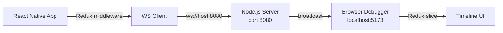
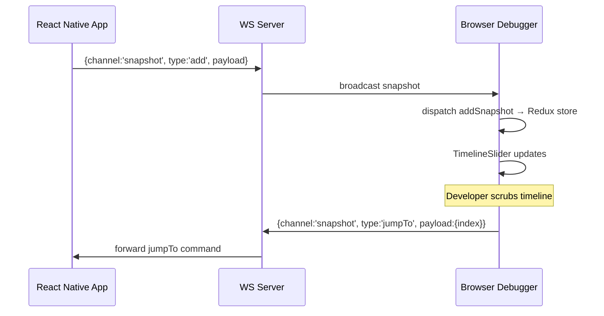

# Reactime Native (Alpha)

A **React Native** time-travel debugger inspired by [Reactime](https://github.com/open-source-labs/reactime).
Unlike the original Chrome extension, this project targets React Native apps (Expo, Metro, Hermes) and runs with **no native code** — only JavaScript.

This project is currently in **alpha**. The team is actively building out important features and plan to package for npm soon.

---

## Status

**Alpha stage.** Not production-ready. The team is building toward an npm package release.

Currently you can:
- Stream **React Native state snapshots** over WebSocket
- Scrub through state history in a browser-based debugger
- Capture early **performance metrics** (commit duration, lag)
- Manage snapshot history with **Redux Toolkit** on the frontend

---

## Architecture



Reactime Native is split into three moving parts:

1. **Agent (inside RN app)**
   - Hooks into the React DevTools global hook (`__REACT_DEVTOOLS_GLOBAL_HOOK__`)
   - Intercepts Fiber commits
   - Traverses the Fiber tree to collect props/state
   - Serializes snapshots and streams them over WebSocket

2. **WebSocket server**
   - Simple Node server that relays snapshots from RN → browser UI
   - Acts as the "bridge" layer between environments

3. **Debugger UI (browser)**
   - Built with React + Vite
   - Uses Redux Toolkit slices to store snapshots, metrics, and UI state
   - Provides timeline scrubber, import/export, and basic controls

### Snapshot capture + replay flow



---

## Fiber: What We're Capturing

React uses an internal **Fiber tree** to track every component instance.
- Think of it as React's equivalent of the **DOM tree**: each node holds props, state, hooks, and children.
- On every commit, React walks this tree to decide what to update on screen.

In our agent code (`MobileSample.tsx`), we:
- Subscribe to `onCommitFiberRoot`
- Traverse the Fiber tree for only the stateful components
- Convert each new commit as a "snapshot" and feed in a serialized JSON representation
- Broadcast snapshots to the WebSocket server

The frontend debugger UI then reconstructs these snapshots into a timeline view.

---

## Architecture Decisions

| Decision | Choice | Rationale |
|----------|--------|-----------|
| Transport | Native WebSocket API | No Socket.IO overhead; reliable RN compatibility |
| MVP scope | One-way flow (RN → browser) | Delivers core observability value without blocking on bidirectional complexity |
| IP resolution | `wsConfig.ts` fallback chain | Eliminates hardcoded IPs; any dev sets `EXPO_PUBLIC_WS_HOST` in `.env.local` |
| Server design | `createServer()` factory + `require.main` guard | Separates library behavior from CLI; makes `broadcast()` unit-testable |
| Browser state | Redux Toolkit slices | Shared snapshot history + metrics across multiple components without prop drilling |

See [CLAUDE.md](./CLAUDE.md) for the full engineering decision log.

---

## Environment Variables

| Variable | Where | Description |
|----------|-------|-------------|
| `EXPO_PUBLIC_WS_HOST` | `sample-RN-app/.env.local` | Override WebSocket host (LAN IP or hostname). Strips any leading scheme or embedded port automatically. |

The browser client connects to `ws://localhost:8080` by default. Update `client/src/transport/socket.ts` if your server runs on a different host.

---

## Running Tests

Each package has its own Vitest config with environment-specific settings
(`jsdom` for the browser client, `node` + React Native stubs for the RN app).
**Do not run `npx vitest` from the repo root** — there is no root-level config,
so Vitest will pick up all test files without the correct environments and
produce misleading failures.

Use the per-package scripts instead:

```bash
# Browser client tests (jsdom environment)
npm run test:client

# React Native app tests (node environment + RN stubs)
npm run test:rn

# Both in sequence
npm test
```

---

## Getting Started (Dev Setup)

> ⚠️ MVP still in progress — setup may change.

1. Clone the repo.
2. Start the project:
   ```bash
   # 1) WebSocket server
   cd server && node server.js

   # 2) Sample React Native app (or use the hook to access the Fiber tree of your own RN app)
   #    By default the app auto-detects the dev server host via Expo's hostUri.
   #    To override (e.g. on a physical device):
   #    EXPO_PUBLIC_WS_HOST=192.168.1.42 npx expo start
   cd sample-RN-app && npx expo start

   # 3) Debugger UI (located at localhost:5173)
   cd client && npm run dev
   ```

---

## Roadmap / Planned Features

- **Component tree visualization**
  Display the React component hierarchy with props/state at each node.

- **Snapshot diffing**
  Highlight what changed between two consecutive states.

- **Expanded metrics**
  Track fibers updated per commit, event loop lag, and app-level profiling.

- **Snapshot persistence**
  Optionally store history to disk for long debugging sessions.

- **Bidirectional time-travel**
  Replay state back into the running RN app.

- **UI polish**
  Better timeline controls, filtering, and visualization.

- **Packaging & distribution**
  Publish as an npm package for easy setup with any RN project.

---

## License

This project is licensed under the MIT License - see the [LICENSE](LICENSE) file for details.
